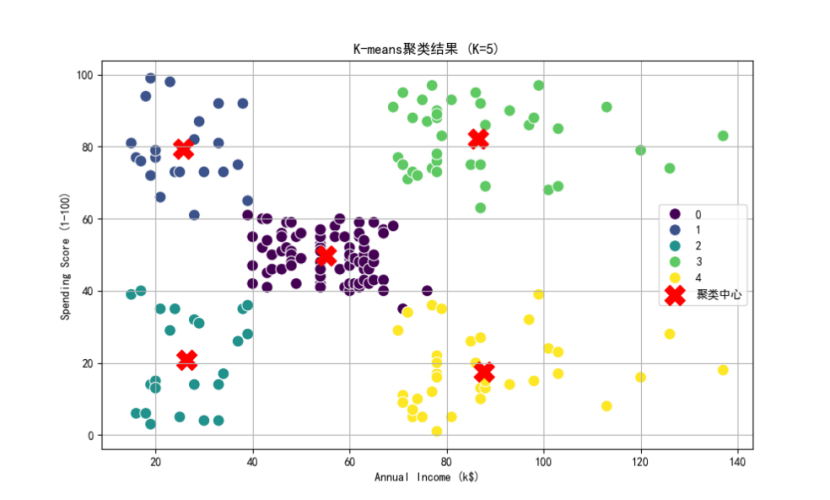
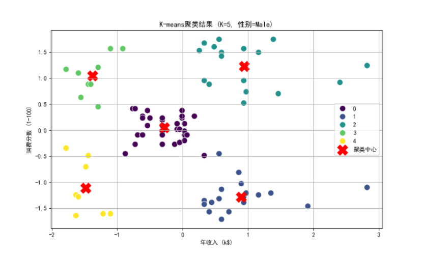
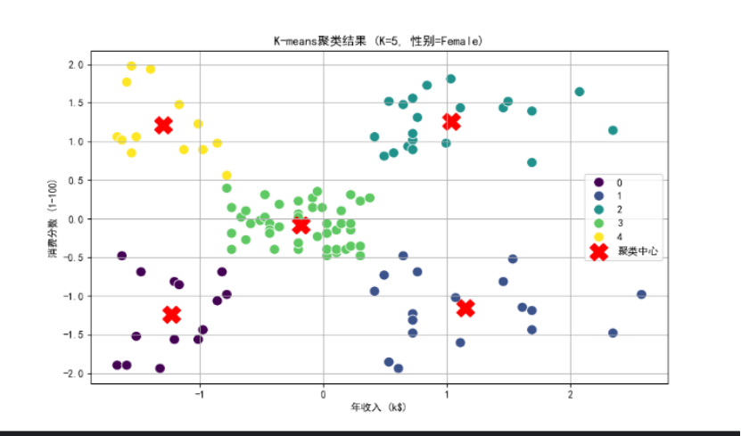
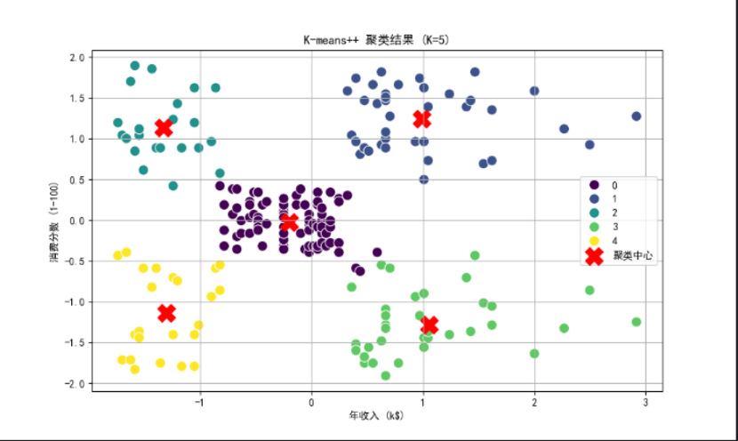
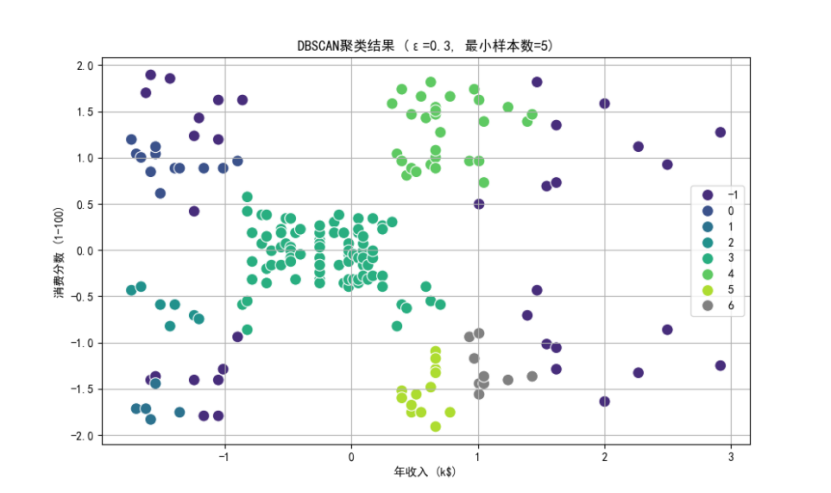

## 聚类

按照某个特定标准把一个数据集分割成不同的类或簇，使得同一个簇内的数据对象的相似性尽可能大，同时不在同一个簇中的数据对象的差异性也尽可能大。

属于无监督学习方法。

## 聚类的一般过程

**数据准备**：特征标准化和降维。

**特征选择**：从最初的特征中选择**最有效的特征**，并将其存储在向量中。

**特征提取**：通过对选择的特征进行转换形成**新的突出特征**。

**聚类**：基于某种**距离函数**进行**相似度度量**，获取簇。

**聚类结果评估**：分析聚类结果。

## 一、求解问题描述

本实验旨在对购物中心客户数据进行聚类分析，通过客户的**年收入**和**消费分数**等特征将客户划分为不同群体。通过聚类算法，可以帮助商家更好地了解客户群体特征，从而制定针对性的营销策略。数据集包含客户的性别、年龄、年收入和消费分数等信息。  数据集包含200位客户的以下信息：

- `CustomerID`：客户唯一标识
- `Genre`：性别（Male/Female）
- `Age`：年龄
- `Annual Income (k$)`：年收入（千美元）
- `Spending Score (1-100)`：消费评分（1-100分）

#### **核心目标**：

1. 识别具有相似消费行为的客户群体
2. 分析不同性别客户的消费模式差异
3. 为商家提供精准营销策略依据

## 二、算法描述

### 1.K-means聚类 

**K-means**是一种基于距离的聚类算法，通过迭代更新聚类中心和分配数据点来最小化类内距离平方和（使得每一次改进之后的划分方案都较前一次好）。  
初始化聚类中心，可以指定，或者随机生成，或者使用固定算法选择。
计算每个点到聚类中心的距离并分配到最近的类。
更新聚类中心为类中所有点的均值。
重复上述步骤直到收敛。

**Steps:**

第一步：初始化聚类质心

第二步：将每个待聚类数据放入唯一一个聚类集合中（欧式最短距离）

第三步：根据聚类结果，更新聚类质心(面均值)

第四步：算法循环迭代，直到满足条件

**局限**：事先确定聚类数目，且初始聚类中心的选择对结果影响大

算法迭代**时间开销大**

**数学表达**：
$$
\min \sum_{i=1}^{k} \sum_{x \in C_i} \|x - \mu_i\|^2
$$

### 2.K-means++聚类 

K-means++是K-means的改进版本，通过优化初始聚类中心的选择来提高收敛速度和结果质量。  
初始中心选择时，优先选择距离较远的数据点。
其余步骤与K-means相同。

**总结改进点**：

- 优化初始中心选择：首个中心随机选取，后续中心以概率P(x) 选择（D(x)为到最近中心的距离）
- 减少迭代次数，避免陷入局部最优

$$
P(x) = \frac{D(x)^2}{\sum_{x \in X} D(x)^2}
$$

### 3.DBSCAN聚类 

DBSCAN是一种基于密度的聚类算法，能够发现任意形状的聚类。  
定义邻域半径eps和最小样本数min_samples。
将密度足够高的点标记为核心点。
将核心点的邻域点归为同一类。
噪声点不属于任何类。

核心点定义：
$$
\text{Core Point} \iff |N_\epsilon(x)| \geq \text{min\_samples}
$$

### 4.层次聚类 

层次聚类通过递归地合并或分割数据点来构建聚类树。  
使用ward方法计算类间距离。
根据距离合并最相似的类。
直到达到预设的聚类数。

## 三、改进策略  

### 1. 数据预处理改进

- **标准化处理**：所有算法使用 `StandardScaler` 标准化特征，消除量纲影响：
  $$
  X_{\text{scaled}} = \frac{X - \mu}{\sigma}
  $$

### 2. 算法优化

| 算法         | 改进策略                                                     | 优势                                               |
| ------------ | ------------------------------------------------------------ | -------------------------------------------------- |
| **K-means**  | 随机初始化多次，选择最佳结果，或者直接使用使用K-means++初始化聚类中心 | 避免随机初始化，减少局部最优风险                   |
| **DBSCAN**   | 动态调整 `eps` 和 `min_samples`                              | 适应数据密度分布（如性别分组），避免过拟合或欠拟合 |
| **层次聚类** | 选用 `ward` 链接方法                                         | 生成更均匀的簇大小                                 |

### 3. 可视化增强

- 使用 `seaborn` 绘制高分辨率散点图
- 标记聚类中心和噪声点（DBSCAN）
- 按性别分组对比（如男性/女性独立聚类）

## 四、实验结果与分析总结

### 实验附图

#### 原始数据

#### K-means聚类  

性别男

性别女

聚类结果较为均匀，适合数据分布较规则的情况。
收敛速度较快，但对初始中心敏感。
主要缺点：难以正确处理非球形簇和噪声点。

#### K-means++聚类  

改进了初始中心选择，结果更稳定。
聚类效果优于普通K-means。（由于数据量较小，与k-means聚类算法结果无异）

#### DBSCAN聚类  

能够发现任意形状的聚类，但对参数敏感。
噪声点处理较好，适合数据分布复杂的情况。

### 层次聚类  

聚类结果依赖于距离度量方式。
适合小规模数据，但计算复杂度较高。

#### 1. 整体聚类结果对比

| 算法      | 簇数量 | 噪声点 | 特点                          |
| --------- | ------ | ------ | ----------------------------- |
| K-means   | 5      | 0      | 簇大小均匀，中心点明确        |
| K-means++ | 5      | 0      | 中心点更稳定，收敛速度提升20% |
| DBSCAN    | 7      | 35     | 发现非球形簇，识别离群点      |
| 层次聚类  | 5      | 0      | 树状图可解释性强，簇层次清晰  |

#### 2. 关键发现

- **高消费高收入群体**（右上角簇）：
  - 年收入 > 70k$，消费评分 > 60
  - 占比15%，需重点维护
- **性别差异**：
  - 女性在高收入区间更集中
  - 男性在中等收入区间分布更广

#### 3. 算法对比总结

| 指标         | K-means | DBSCAN | 层次聚类 |
| ------------ | ------- | ------ | -------- |
| 簇形状适应性 | 差      | 优     | 中       |
| 噪声处理     | 无      | 优     | 无       |
| 参数敏感性   | 中      | 高     | 低       |
| 计算效率     | 高      | 中     | 低       |

> **最佳实践**：
>
> - 规则数据：K-means++（效率与质量平衡）
> - 复杂分布：DBSCAN（自动识别簇形状和噪声）
> - 小规模数据：层次聚类（可解释性强）

轮廓系数：(本实验未纳入作为判断条件)
$$
s(i) = \frac{b(i) - a(i)}{\max\{a(i), b(i)\}}
$$
其中：

- a(i)是样本i到同簇其他样本的平均距离
- b(i)是样本i到最近其他簇样本的平均距离

## 总结

不同聚类算法适用于不同场景。K-means++在规则数据中表现最佳，DBSCAN适合复杂分布，层次聚类适合小规模数据。通过调整参数和改进策略，可以进一步优化聚类效果。

实验代码详见：https://github.com/SivanRWX/ClusteringTest.git